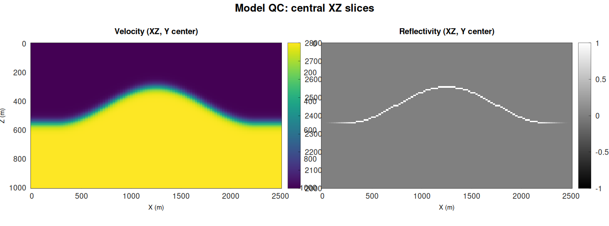
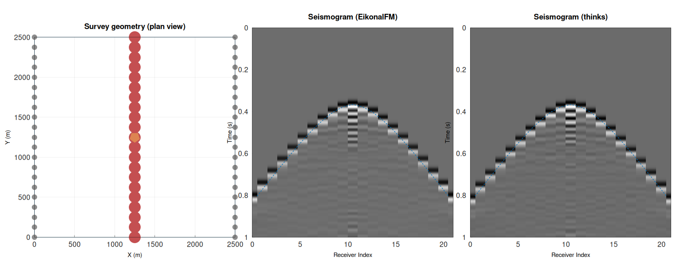

# Eikonal Benchmark (3D) — C++

C++-версия бенчмарка для сравнения солверов эйконала в 3D (и последующего борновского моделирования сейсмограммы для QC).

Решаем эйкональное уравнение методом Fast Marching (FMM) для сетки скоростей, после чего считаем времена пробега на наборе источников/приёмников и сравниваем:

* времена пробега (QC по полям эйконала)
* сейсмограмму вдоль выбранной **центральной линии** приёмников

## Поддерживаемые солверы

Задаются в `benchmark.ini` параметром `solvers`:

* `eikonalfm` — C++ ядро [eikonalfm](https://github.com/kevinganster/eikonalfm)
* `thinks` — header-only FMM от [thinks](https://github.com/thinks/fast-marching-method)

По умолчанию первый солвер из списка — эталон для годографа и RMSE.

## Результаты QC (картинки)

Сейчас в репозитории лежат:

* модель: `model_qc_xz.png`
* QC сейсмограммы: `qc_combined_row.png`

`model_qc_xz.png`:



`qc_combined_row.png`:



## Быстрый старт

### 1) Зависимости

* CMake >= 3.14
* C++17 компилятор

При первой сборке `eikonalfm`, `thinks` и `matplot++` подтягиваются через CMake FetchContent.

### 2) Собрать и запустить

```bash
cd eikonal_bench_cpp
mkdir build && cd build
cmake .. -DCMAKE_BUILD_TYPE=Release
cmake --build . -j
./benchmark_cpp ../benchmark.ini
```

После запуска в `build/` будут сохранены (можно скопировать в корень проекта для README):

* `model_qc_xz.png`
* `qc_combined_row.png`

## Конфигурация

Все параметры вынесены в `benchmark.ini`:

* размер сетки (`nx`, `ny`, `nz`)
* шаги (`dx`, `dy`, `dz`)
* источник (`sx`, `sy`, `sz`)
* плотность приёмников на поверхности (`step_x`, `step_y`)
* выбор центральной линии из сетки приёмников для QC сейсмограммы (`line_axis`)
* параметры сейсмограммы (`dt`, `nt`, `wave_freq`)
* параметры скорости (`layer1_vel`, `layer2_vel`, `dome_*`)
* рефлективити (`refl_value`)
* список солверов (`solvers`)
* параллелизация (`max_workers`: `1` — sequential, `>1` — thread pool, `<=0` — auto)
* параметры eikonalfm (`eikonalfm_order`)

## Сравнение производительности

В логе печатается:

* **RMSE Eikonal Time vs …** — сравнение TT полей эйконала на выбранных точках (эталон — первый солвер)
* **Timing Summary** — времена для каждого солвера

## Мои результаты на текущих параметрах

### Последовательный режим (`max_workers = 1`)

**C++ (`eikonal_bench_cpp`):**

```
--- Timing Summary ---
  EikonalFM     total=   20.64s  solve=   20.61s  avg= 0.3220s  rel_to_eikonalfm=1.00x
  thinks        total=   42.25s  solve=   42.10s  avg= 0.6578s  rel_to_eikonalfm=2.05x
```

**Python, только EikonalFM (`eikonal_bench`, `MAX_WORKERS = 1`):**

```
  EikonalFM     total=   19.12s  avg= 0.2985s  rel_to_sfmm=0.68x
```

### Параллельный режим (16 workers)

**C++ (`eikonal_bench_cpp`):**

```
--- Timing Summary ---
  EikonalFM     total=    2.42s  avg= 0.5548s  rel_to_eikonalfm=1.00x
  thinks        total=    4.49s  avg= 1.0495s  rel_to_eikonalfm=1.85x
```

**Python, только EikonalFM (`eikonal_bench`, `MAX_WORKERS = 16`):**

```
  EikonalFM     total=    3.14s  avg= 0.6481s  rel_to_sfmm=0.45x
```

В параллельном режиме **`total`** — wall time (основная метрика для сравнения); **`avg`** — среднее время одного solve с учётом конкуренции потоков. EikonalFM в Python и C++ — одно и то же ядро `Marcher::solve`; разница в пределах прогона/окружения.

## Рейтинг солверов по совокупным таймингам

Ниже рейтинг солверов по результатам моих тестов:

1. `EikonalFM` (`eikonalfm`)
2. `thinks`
